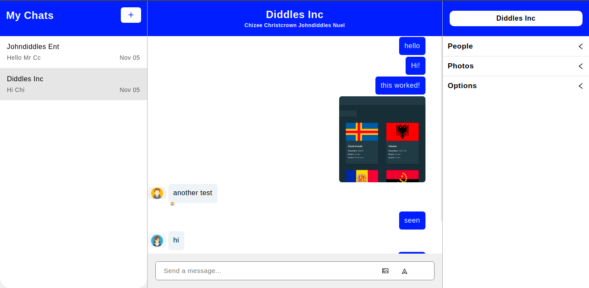

## JDChat
JDChat is a messaging app built with ReactJs and [Chatengine](https://chatengine.io)

Live link is hosted on [Netlify](https://jdchat.netlify.app/)

### Progress so far
- Login feature works for only created users. There are 3 available users for trials
  - username = Christcrown, password = 123123
  - username = Chizee, password = 123123
  - username = Nuel, password = 123123

- Chats are updated real time. 
- Users can create chat rooms and add other users

### Possible updates to come
Sign up feature for new users
